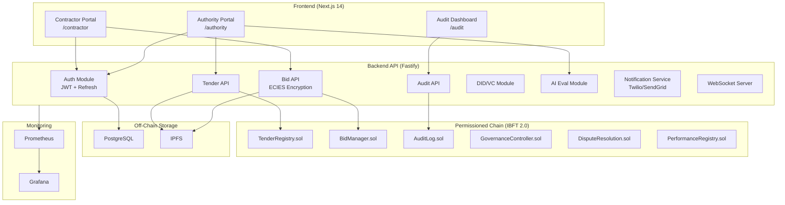
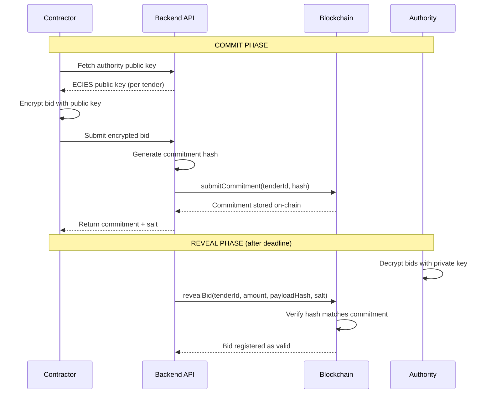
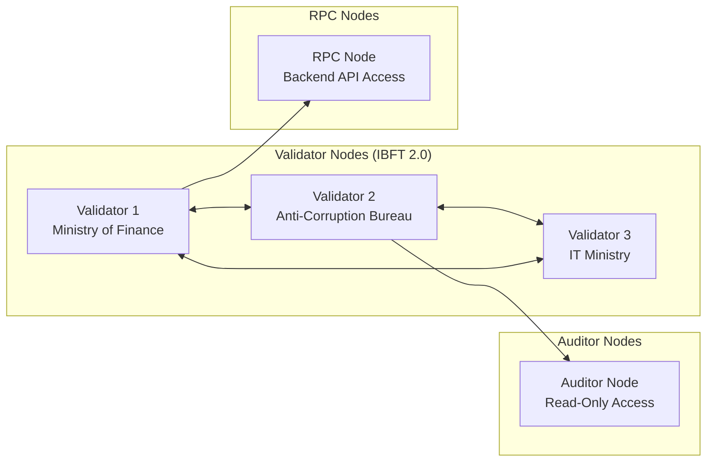

# TenderChain System Architecture

## High-Level Architecture

## Commit-Reveal Flow

## Node Architecture

## Data Flow

| Layer | Technology | Purpose |
|-------|-----------|---------|
| Presentation | Next.js 14 + TailwindCSS | 3 portals with role-based access |
| API | Fastify + TypeScript | REST + WebSocket bridge |
| Auth | JWT + Refresh Tokens | 4-hour sessions with rotation |
| Encryption | ECIES (per-tender keys) | Bid confidentiality |
| Blockchain | Polygon Edge (IBFT 2.0) | Immutable procurement records |
| Storage | PostgreSQL + IPFS | User accounts + document storage |
| Identity | W3C DID + VC | Contractor verification |
